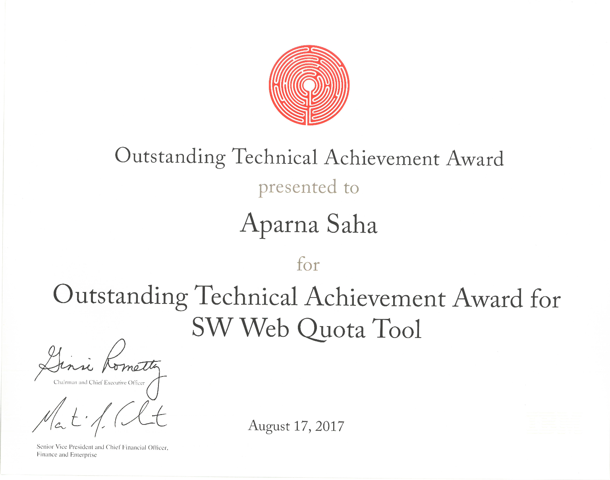

# Aparna Saha

**`Senior Software Engineer`**

With 14 years of experience in software development, I've specialized in backend technologies such as PHP, Node.js, and Java, as well as frontend frameworks like React and Angular. I thrive on building distributed systems, crafting microservices, and leveraging platforms like IBM Cloud and AWS Cloud. Passionate about system design, I've led successful projects by guiding teams with dedication and adaptability. I take pride in mentoring interns and junior developers, helping them grow in their roles. My commitment is to deliver high-quality solutions and consistently contribute to the success of the team.

🔗 [linkedin.com/aparnasaha](https://www.linkedin.com/in/aparnasaha/) 

## Tech Stack

  
  
  
  
  
  
  
  
  
  
  
  
  
  
  
  
  

## Achievements

  
  
    
  
  
  
    
  
  
  
  

